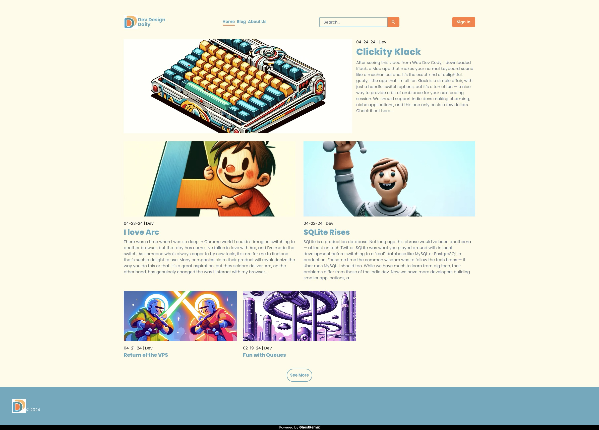

# GhostRemix



Ghost as a headless CMS with Remix and Chakra UI by [Mikan Labs](https://mikanlabs.com). Easy deployment to Fly.io.

Check it out live at [Dev Design Daily](https://devdesigndaily.com).

[Official Documentation Website](https://ghostremix.com)

## Table of Contents

- [Dependencies](#dependencies)
- [Local Development](#local-development)
  - [Get the code](#get-the-code)
    - [Using the Template](#using-the-template)
    - [Forking the Repository](#forking-the-repository)
  - [Mailgun](#mailgun)
  - [Basics](#basics)
  - [Theme](#theme)
  - [Favicon](#favicon)
- [Pages](#pages)
- [Test Docker Build](#test-docker-build)
- [Deploy to Fly.io](#deploy-to-flyio)
  - [GitHub Actions](#github-actions)
  - [Command Line](#command-line)
  - [Custom Domains and SSL](#custom-domains-and-ssl)
- [RapidRead](#rapidread)

## Dependencies

- [NPM](https://www.npmjs.com/)
- [Docker](https://www.docker.com/)
- [Tilt](https://tilt.dev/)
- [flyctl](https://fly.io/docs/flyctl/installing/)

## Local Development

### Get the code

You have two options to get started with GhostRemix: using the template or forking the repository. Here's when to use each approach:

#### Using the Template

Use the template when:

- You want to create a private repository (GitHub doesn't allow forking directly to a private repo).
- You don't plan to contribute back to the original project.
- You want a clean start without the original project's commit history.

To use the template:

1. Navigate to the [GhostRemix repository](https://github.com/mikan-laboratory/ghost-remix).
2. Click the "Use this template" button.
3. Choose a name for your new repository and select whether it should be public or private.
4. Click "Create repository from template".

Alternatively, you can use the GitHub CLI:

```bash
gh repo create your-new-repo --template mikan-laboratory/ghost-remix --private
cd your-new-repo
git push --set-upstream origin main
```

#### Forking the Repository

Fork the repository when:

- You want to contribute back to the original project.
- You want to keep up with updates to the original project.
- You're okay with a public repository (you can make it private later, but it starts as public).

To fork the repository:

1. Navigate to the [GhostRemix repository](https://github.com/mikan-laboratory/ghost-remix).
2. Click the "Fork" button in the top-right corner.
3. Choose where to fork the repository (your personal account or an organization).
4. Optionally, you can change the name of the forked repository.
5. Click "Create fork".

After forking, clone your forked repository:

```bash
git clone https://github.com/your-username/ghost-remix.git
cd ghost-remix
```

To keep your fork up to date with the original repository:

1. Add the original repository as an upstream remote:

   ```bash
   git remote add upstream https://github.com/mikan-laboratory/ghost-remix.git
   ```

2. Fetch the latest changes from the upstream repository:

   ```bash
   git fetch upstream
   ```

3. Merge the changes into your local main branch:

   ```bash
   git checkout main
   git merge upstream/main
   ```

4. Push the updated main branch to your fork:
   ```bash
   git push origin main
   ```

Remember, if you make changes you want to contribute back to the original project, create a new branch for your changes and submit a pull request from that branch.

### Mailgun

You don't need Mailgun to get started, but you'll need it for email-based workflows like member sign up.

Don't worry about the $35 a month price tag, immediately after signing up for the trial, you can downgrade to the flex plan.

1. Create [Mailgun](https://www.mailgun.com/) account.

2. Navigate to Sending -> Domains. You should see a test domain that looks like `sandbox1234567890abcdef1234567890ab.mailgun.org`

3. Add your email as an authorized recipient.

4. Scroll down and select API Keys. Create a new API key and copy the key.

5. Find the correct base URL [here](https://documentation.mailgun.com/en/latest/api-intro.html#base-url).

### Basics

1. Create `.env` file in root directory, using `.env.example` as a template.

2. Use `tilt up` to install dependencies, generate a prisma client, and start services.

3. Seed database with the button in Ghost section of the Tilt UI.

   - The production script seeds an owner and basic settings. The development script includes posts and comments.
   - If you want to inspect the database, you can manually trigger a GUI from the Tilt UI.

4. The Node engine is set to 18.19 in package.json to match the production runtime. This follows the Ghost team's advice. You can find more information [here](https://ghost.org/docs/faq/node-versions/#why-follow-lts). Using a different version locally shouldn't be an issue, but you will see a warning when you run `npm install`. If you want to use this version in development, you can use a tool like [nvm](https://github.com/nvm-sh/nvm?tab=readme-ov-file#install--update-script) to manage multiple Node versions.

### Theme

You can change the theme colors for components in `app/theme/theme.ts`.

### Favicon

You can replace the favicon.ico with your own in the public folder. If you are using a PNG, you will need to add `<link rel="icon" href="/favicon.png" type="image/png" />` to the `<head>` component under `<Meta/>` in the `root.tsx` file. If you are unsure about turning your logo into a favicon, we used [favicon.io](https://favicon.io/) to do it for free.

### Pages

Published pages are automatically added to the menu in the navigation bar.

## Test Docker Build

1. Build image and run container with `make all`.

2. Clean image and container with `make clean-all`.

## Deploy to Fly.io

### Prerequisites

1. Create [Fly.io](https://fly.io) account.

2. Authenticate with `flyctl auth login`.

3. Create app with `flyctl launch --no-deploy`.

### GitHub Actions

1. Navigate to the newly created application in the Fly.io dashboard and get a deploy token.

2. Set secrets in GitHub repository settings.

3. Manually trigger by going to Actions tab and selecting `Deploy`. Click `Run workflow` and enter the branch name to deploy.
   - You can update this action to trigger on push to `main` by changing the `on` section of the workflow file to `push: [main]`

### Command Line

1. Set secrets

```
flyctl secrets set GHOST_CONTENT_API_KEY="my-api-key-value" \
   OWNER_EMAIL="my-email-value" \
   OWNER_PASSWORD="my-password-value" \
   MAILGUN_DOMAIN="somedomain" \
   MAILGUN_API_KEY="somekey" \
   MAILGUN_BASE_URL="mailgunbase" \
   MAILGUN_USER="postmaster@somedomain \
   MAILGUN_PASSWORD="password" \
   JWT_SECRET="somejwtsecret" \
   SITE_TITLE="My Site" \
   SITE_DESCRIPTION="My website" \
   OWNER_NAME="Admin" \
   OWNER_SLUG="admin" \
   BLOG_URL="https://mysite.com" \
   COMMENT_SETTINGS="all" \
   MEMBERS_SIGNUP_ACCESS="none" \
   RAPID_READ="all" \
   ANTHROPIC_API_KEY="somekey"
```

2. Deploy

```
flyctl deploy
```

### Custom Domains and SSL

More details [here](https://fly.io/docs/networking/custom-domains-with-fly/)

1. List your app ip addreses with `flyctl ips list`.

2. Create SSL certificates.

```
flyctl certs create mysite.com
flyctl certs create www.mysite.com
```

3. Use the ipv4 address to create an A record in your DNS provider, and the ipv6 address to create a AAAA record. Create a CNAME record for `www`.

## RapidRead

- Add `RapidRead` with an [Anthropic API Key](https://docs.anthropic.com/claude/docs/getting-access-to-claude).
